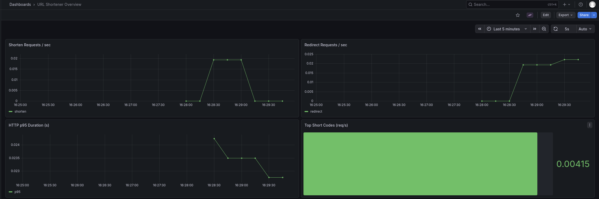

# URL Shortener Service

Микросервис для сокращения URL-адресов с использованием Go, PostgreSQL, Redis и Prometheus.

## Архитектура

- **Backend**: Go с использованием gorilla/mux
- **База данных**: PostgreSQL для постоянного хранения
- **Кэширование**: Redis для повышения производительности  
- **Мониторинг**: Prometheus + Grafana для сбора и визуализации метрик
- **Контейнеризация**: Docker Compose

## Функциональность

- Создание коротких ссылок
- Редирект по коротким ссылкам
- Просмотр статистики использования сервиса
- Мониторинг метрик производительности
- Автоматическое кэширование в Redis

## Быстрый старт

### Требования

- Docker
- Docker Compose

### Запуск

```bash
# Клонирование репозитория
git clone <repository-url>
cd url-shortener
```
```bash
# Запуск всех сервисов
make docker-run
```

## Эндпоинты

### Health Check
```bash
# Запрос
curl http://localhost:8080/health

# Ответ
{"status":"OK"}
```

### Создание короткой ссылки
```bash
# Запрос
curl -X POST http://localhost:8080/api/shorten \
  -H "Content-Type: application/json" \
  -d '{"url":"https://google.com"}'

# Ответ
{"short_url":"http://localhost:8080/l74pSP","original_url":"https://google.com"}
```

### Получить все ссылки
```bash
# Запрос
curl http://localhost:8080/api/urls

# Ответ
[{"short_url":"http://localhost:8080/l74pSP","original_url":"https://google.com"}]
```

### Редирект по короткой ссылке
```bash
# Запрос
curl -i http://localhost:8080/l74pSP

# Ответ (пример)
HTTP/1.1 302 Found
Location: https://google.com
```

### Метрики Prometheus
```bash
# Запрос
curl http://localhost:8080/metrics
```

## Grafana Dashboard


